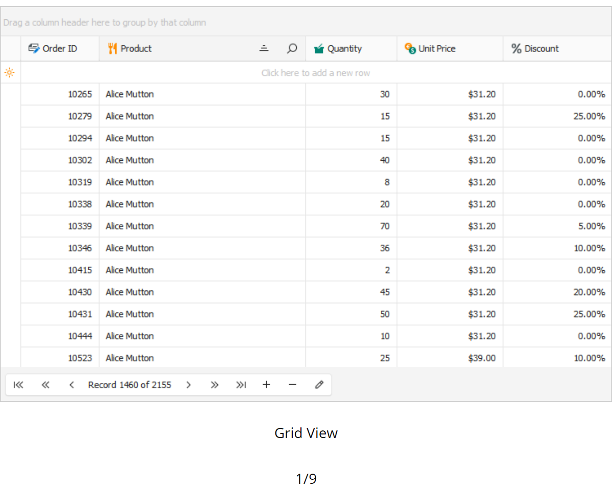
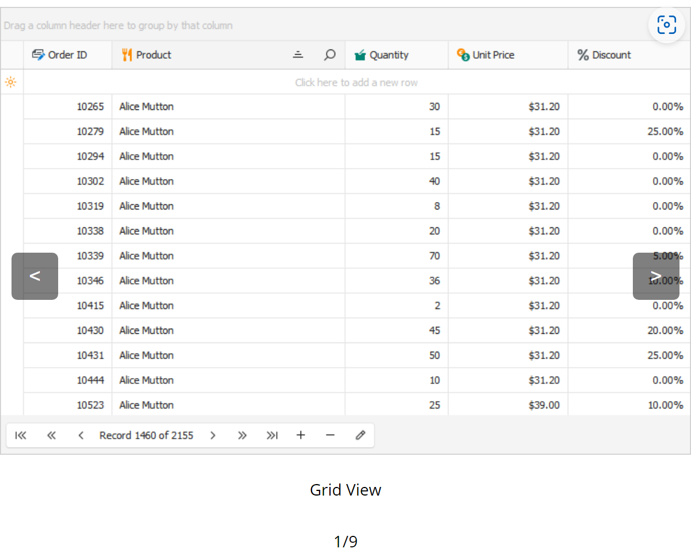
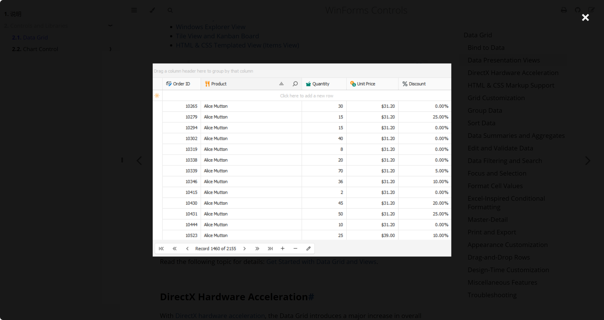
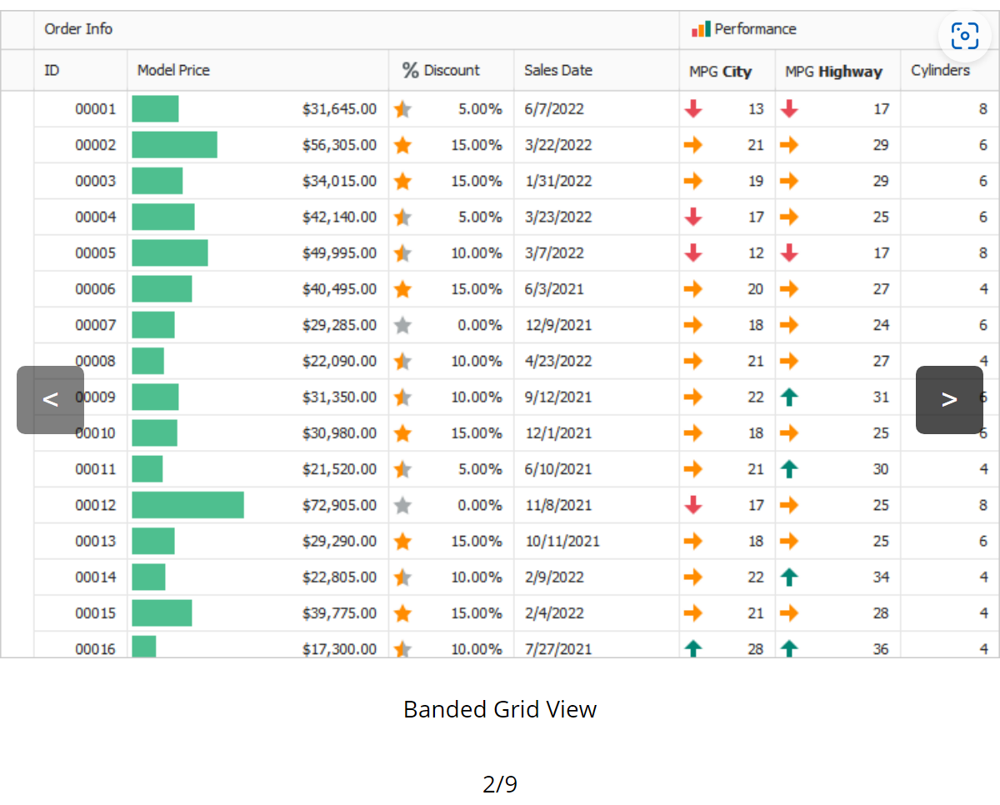

# mdbook-image-slider

## 特点

- 鼠标置于图片查看区域时显示切换图片按钮
- 点击图片可以缩放查看，移动端也支持点击图片进行缩放和双击缩小图片
- 显示当前查看图片的进度
- 支持显示图片描述信息

## 安装

将如下配置添加到`book.toml`:

```toml
[preprocessor.image-slider]
command = "mdbook-image-slider"
renderer = ["html"]
```

## 用法

```
{{image-slider}}
image: http://vinciyan.com/image-public/image-20240831215150-edx0d4e.png caption: Picture 1 Description
image: http://vinciyan.com/image-public/0a41dd35-7079-44d1-93f8-995a99d011b0.png caption: Picture 2 Description
image: http://vinciyan.com/image-public/0a1e65f4-7ced-4ef0-ba7d-120014a0d4.png caption: Picture 3 Description
{{/image-slider}}
```

##  效果







